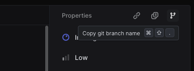

# Linear create branch

Works with [linear.app](linear.app).

When clicking on the branch icon in linear: Copy a `git checkout -b $name` with a custom branch name format.



## Install

https://raw.githubusercontent.com/shiftgeist/deno-userscript-copy-linear-branch-name/refs/heads/main/dist/linear-create-branch.user.js

## Branch name format

```
$TYPE-$ISSUE_ID-$TITLE
```

Type is currently set strictly to `feat`.
